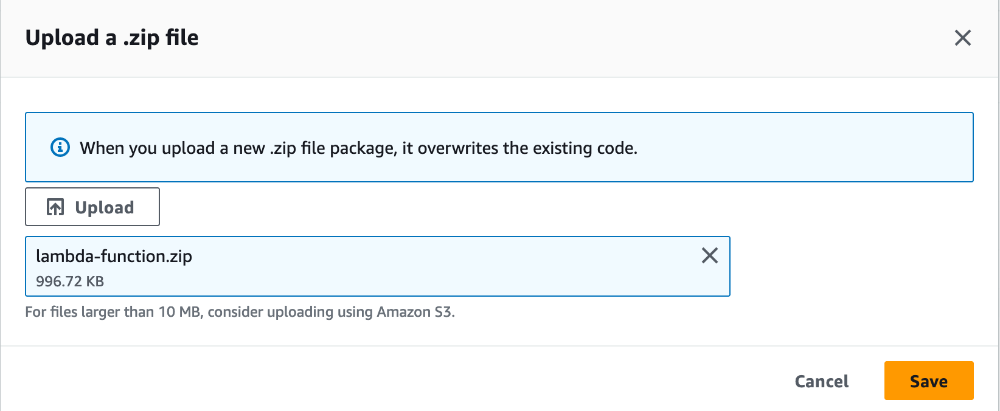
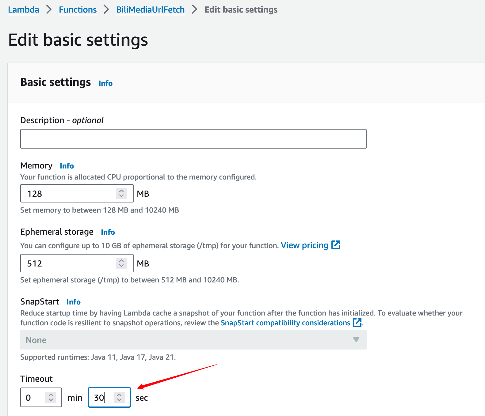
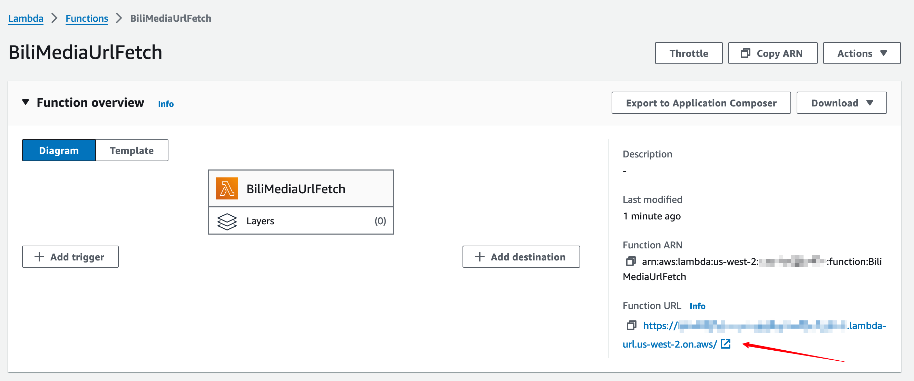
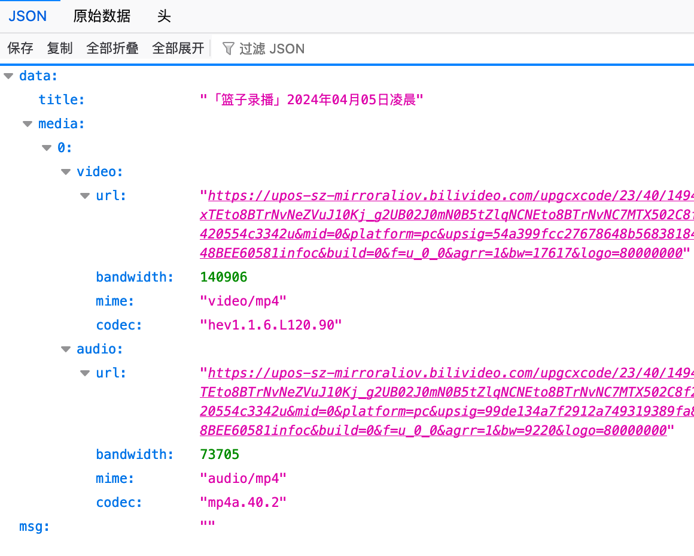
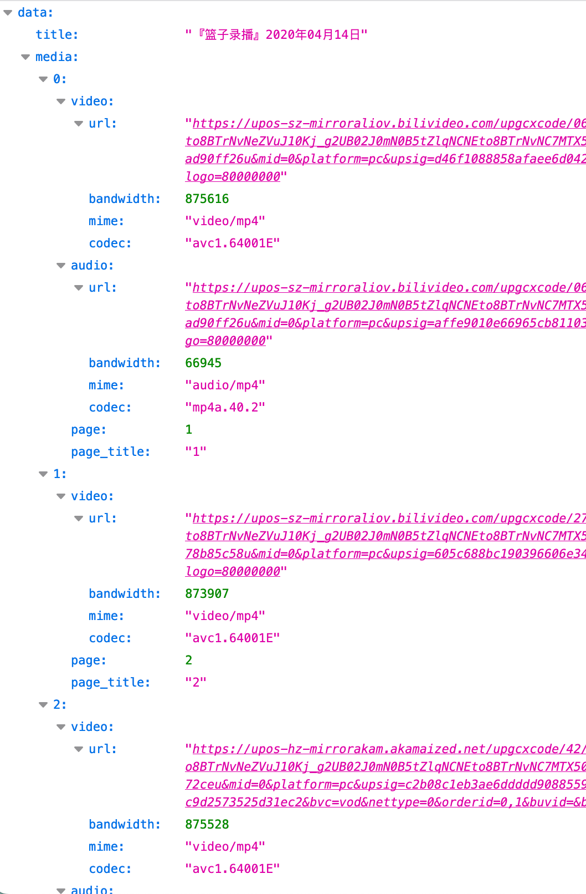

# BiliMediaUrlFetch

## Why

最近在提取B站视频的音频流，看了下B站稿件的page-source带有单独视频流和单独音频流的url，所以弄个lambda function，方便以后再次提取。（主要是用用免费额度，整个方案不花钱）

## How

1. 创建Lambda Function
   
   Runtime选Python

   Architecture选x86_64（因为Github Actions在x86_64运行）

   建议启用function URL，方便使用

2. 上传Lambda zipball
   
   从 [Release](https://github.com/InJeCTrL/BiliMediaUrlFetch/releases/tag/Zipball) 下载zip，上传替换Lambda Function源码

   

3. 更改超时时间

    修改超时时间到半分钟左右，因为有分P的视频会顺序请求每个分片的信息，这里可能会超时

    

4. 使用function URL调试

    

5. 传入GET参数，查看效果

    URL schema: `https://<function URL>/?bvid=<bvid>`

    测试单一分片稿件的视频音频获取：（bvid=BV1VE421g7ya）

    

    测试多分片稿件的视频音频获取：(bvid=BV1sV411Z7Cn)

    