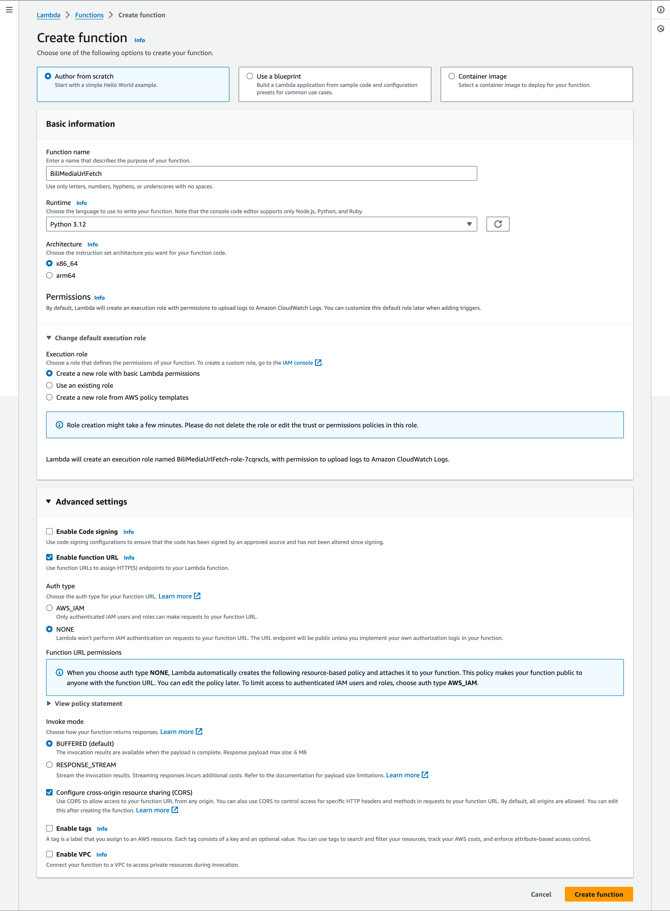

# BiliMediaUrlFetch

## Why

最近在提取B站视频的音频流，看了下B站稿件的page-source带有单独视频流和单独音频流的url，所以弄个lambda function，方便以后再次提取。（主要是用用免费额度，整个方案不花钱）

## How

1. 创建Lambda Function
   
   Runtime选Python

   Architecture选x86_64（因为Github Actions在x86_64运行）

   建议启用function URL，方便使用

